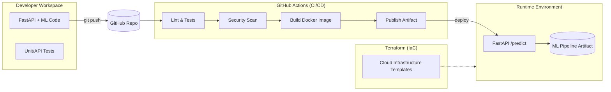

# Titanic Survival Prediction – API de ML com FastAPI, Docker, CI/CD e Terraform

Projeto de Machine Learning em formato “production-like” que prediz a probabilidade de sobrevivência de passageiros do Titanic.

Inclui:

- modelo de ML treinado
- API REST com FastAPI
- aplicação containerizada com Docker
- pipeline de CI/CD com GitHub Actions
- Infraestrutura como Código com Terraform

---

## Architecture Flow



---

## Features

- Survival prediction using ML
- REST API endpoint (/predict)
- Input validation
- Docker support
- CI/CD with GitHub Actions
- Terraform templates for cloud infrastructure

---

## Example Request

```bash
curl -X POST http://localhost:8000/predict \
  -H "Content-Type: application/json" \
  -d '{
    "pclass": 3,
    "sex": "male",
    "age": 22,
    "sibsp": 1,
    "parch": 0,
    "fare": 7.25,
    "embarked": "S"
  }'
```

## Running Locally

```bash
docker build -t titanic-api .
docker run -p 8000:8000 titanic-api
```

Open in your browser: http://localhost:8000/docs (Swagger UI)

## CI/CD Strategy

```md
CI/CD Patterns used:

- container build
- basic validation checks
- packaging for deployment

This ensures every change is validated and reproducible, reducing configuration drift and manual errors.
```

---

## Infrastructure as Code (Terraform)

The infrastructure layer is fully described using Terraform, enabling:

- reproducible environments
- consistent deployments
- cloud-agnostic design principles

This approach reflects production-grade practices commonly used in real-world cloud architectures.

---

## Why This Project Matters (For Recruiters)

This project demonstrates the candidate’s ability to:

- Design cloud-ready architectures for ML systems
- Bridge Data Science and Backend Engineering
- Implement DevOps automation and Infrastructure as Code
- Think in terms of production systems, not isolated experiments
- Apply software engineering and architectural principles to ML workloads

It reflects practical experience with:

- API design
- containerization
- CI/CD pipelines
- cloud infrastructure modeling
- end-to-end solution delivery

---

## Project Status

- Functional ML model
- API available for inference
- Dockerized application
- CI/CD pipelines configured
- Terraform templates included
- Study / portfolio project (not a commercial product)
